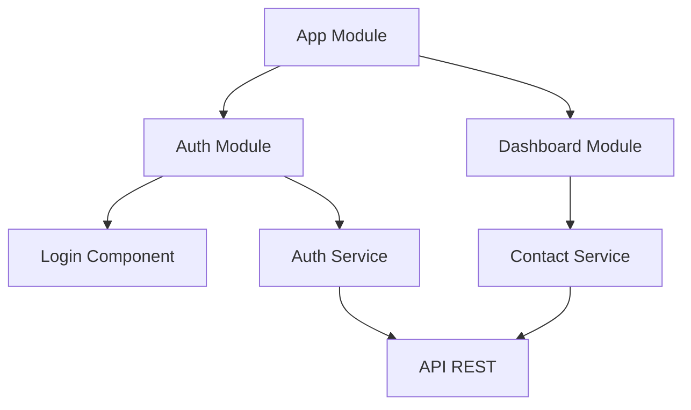
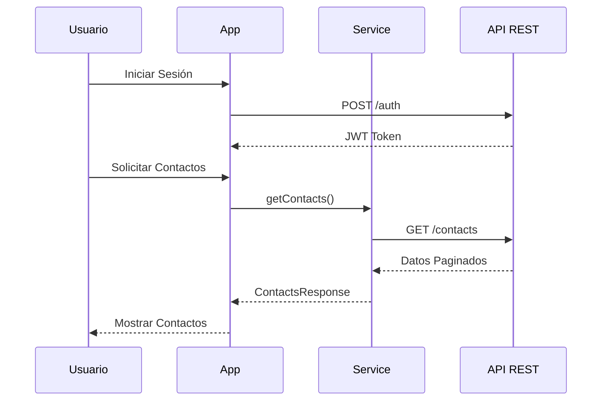

# La Rueda - Sistema de Gestión de Contactos

## 📋 Descripción del Proyecto

La Rueda es una aplicación web desarrollada en Angular 11 que permite gestionar contactos de manera eficiente. El sistema proporciona funcionalidades para crear, listar y gestionar contactos con información relevante como nombres, números de teléfono y placas de vehículos.

_Este es una prueba tecnica._

## 🏗 Arquitectura



## 🛠 Tecnologías Utilizadas

- **Frontend:** Angular 11.1.1
- **Autenticación:** JWT
- **Estilo:** CSS puro
- **HTTP:** Angular HttpClient
- **Testing:** Jasmine + Karma

## 📦 Prerrequisitos

- Node.js (v14.x o superior)
- npm (v6.x o superior)
- Angular CLI (v11.1.2)

## 🚀 Instalación y Configuración

1. **Clonar el repositorio**

   ```bash
   git clone https://github.com/negoride10/LaRueda.git
   cd Julian
   ```

2. **Instalar dependencias**
   ```bash
   npm install
   ```

## 🏃‍♂️ Ejecución

### Desarrollo

```bash
npm start
```

La aplicación estará disponible en `http://localhost:4200`

### Producción

```bash
npm run build
```

Los archivos compilados se generarán en la carpeta `dist/`

## 🔧 Configuración del Proxy

El archivo `proxy.conf.json` está configurado para manejar las peticiones a la API:

```json
{
  "/api": {
    "target": "https://api.larueda.com.co",
    "secure": false,
    "changeOrigin": true
  }
}
```

## 📁 Estructura del Proyecto

```
src/
├── app/
│   ├── auth/
│   │   ├── components/
│   │   │   └── login/
│   │   └── services/
│   │       └── auth.service.ts
│   ├── dashboard/
│   │   └── dashboard.component.ts
│   ├── interceptors/
│   │   └── auth.interceptor.ts
│   └── services/
│       └── contact.service.ts
├── assets/
└── environments/
```

## 🔐 Autenticación

El sistema utiliza JWT (JSON Web Tokens) para la autenticación:

1. El usuario inicia sesión a través del componente `LoginComponent`
2. `AuthService` gestiona el token JWT
3. `AuthInterceptor` añade el token a todas las peticiones HTTP
4. El token se almacena en `localStorage`

## 📡 API Endpoints

### Contactos

- `POST /api/testingreso/login` - Iniciar sesion (200:ok JWT)
- `GET /api/testingreso/contacts` - Listar contactos (paginado)
- `POST /api/testingreso/contacts` - Crear nuevo contacto
- `POST /api/testingreso/contacts` (array) - Crear múltiples contactos

## 💻 Comandos Disponibles

- `npm start` - Inicia el servidor de desarrollo
- `npm run build` - Compila la aplicación para producción

## 🔄 Flujo de Trabajo



## 🛡 Seguridad

- Implementación de interceptores HTTP para tokens
- Sanitización de datos
- Manejo seguro de sesiones
- Protección contra CSRF
- Validación de entrada de datos

## 🔍 Monitoreo y Logs

La aplicación utiliza el sistema de logging integrado de Angular para seguimiento de errores y debugging.

## 📈 Rendimiento

- Lazy loading de módulos
- Optimización de imágenes
- Minificación de archivos
- Tree shaking implementado

## 🌐 Compatibilidad

- Chrome (últimas 2 versiones)
- Firefox (últimas 2 versiones)
- Safari (últimas 2 versiones)
- Edge (últimas 2 versiones)

## 📸 Capturas de Pantalla

### Página de Login


### Login Exitoso


### Creación de Contacto


### Tabla de Contactos


## 👥 Equipo

- Julian Mosquera Restrepo
- Prueba tecnica la rueda
